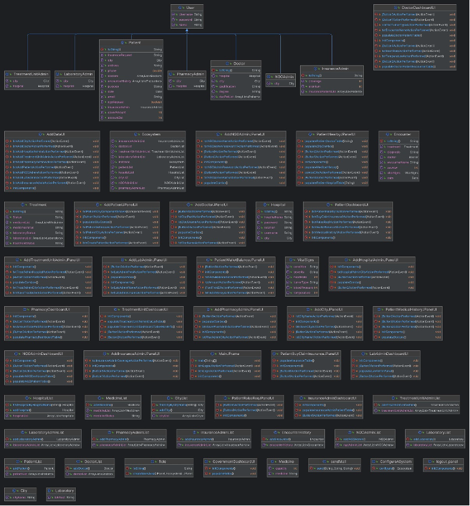
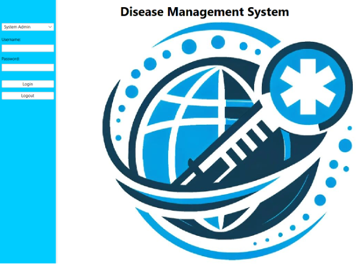
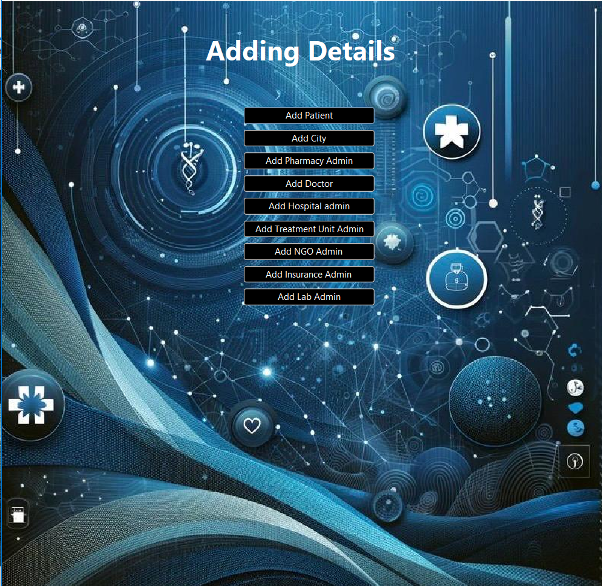
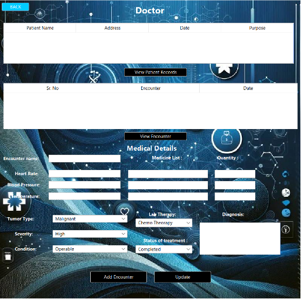

# Disease Management System

## Overview

The Disease Management System, is a comprehensive digital platform designed to efficiently manage hospital ecosystems, streamline login and registration processes, and ensure accurate patient progress tracking. The system empowers both patients and administrators, promoting collaboration among various stakeholders in the healthcare ecosystem.

## Sample images

## Features and Functionalities

The Disease Management System offers a range of features and functionalities:

- **Quick Registration:** A seamless registration process for patients.
- **Patient Progress Tracking:** Accurate tracking of patient and doctor activities.
- **Multi-Party Collaboration:** Facilitates collaboration among patients, doctors, NGOs, governments, insurance, lab administrators, pharmacy professionals, and treatment units.

## Problem Statement

The project aims to provide hands-on experience in developing and implementing complex software systems. The goal is to build a digital platform that serves as a communication system for experts and operational personnel across corporations, organizations, and individual users, promoting collaboration for improved safety, service delivery, and affordability.

## System Hierarchy

### System Admin

The System Admin holds the apex authority, managing entities such as patients, cities, pharmacies, administrators, doctors, hospital administrators, treatment unit administrators, NGO administrators, insurance administrators, and lab administrators. They issue credentials and oversee the entire system environment.

### Patient

Patients receive login credentials from the System Admin, enabling access to features like identifying nearby hospitals and patients, reviewing medical history, managing wallets, initiating NGO requests, and facilitating insurance transactions.

### Doctor

Medical practitioners access patient records, review interactions, and submit diagnoses through a dedicated dashboard provided by the System Admin.

### Report

Reporting authorities access the reporting dashboard to track active patients, hospitals, and doctors, enabling informed decision-making and resource allocation.

### Insurance

Insurance administrators use the Insurance Admin Dashboard to examine and approve insurance claims, ensuring fast and correct processing of patient requests.

### Lab Admin

Lab administrators access the Lab Admin Dashboard to view talks between doctors and patients, monitor treatment progress, and handle treatments more effectively.

### NGO

The NGO Admin Dashboard allows administrators to access specific patient information, monitor financial balances, and sponsor medical bills, promoting a compassionate and supportive environment.

### Pharmacy

Pharmacists use the Pharmacy Dashboard to generate a medication list for each patient, ensuring medication accuracy and transparent invoicing procedures.

### Treatment Unit

The Treatment Unit Dashboard provides healthcare practitioners with a comprehensive view of patient information, improving communication and decision-making within the treatment unit.

## Working

- **Login Panel:** Secure login for system access.
- **Landing Page for System Admin:** System Admin's central control point.
- **Patient and its Details:** Access and manage patient information.
- **Dashboards:** Specific dashboards for different roles (Doctor, Reporting, Lab Admin, etc.).

## Assessment

The Disease Management System exhibits a robust hierarchical structure, efficiently managed by the System Admin. The specialized dashboards cater to the needs of various stakeholders, ensuring seamless communication and collaboration within the healthcare ecosystem.

## Conclusion

In conclusion, the Disease Management System significantly enhances healthcare operations by providing an integrated platform with a wide range of capabilities. The hierarchical structure, coupled with role-specific dashboards, facilitates efficient entity administration and promotes a coordinated approach to patient care. The system not only improves patient care but also encourages collaboration among stakeholders, resulting in a more responsive and integrated healthcare system.

As technology advances, integrated systems like the Disease Management System will play a crucial role in enhancing healthcare services and improving overall health outcomes.
